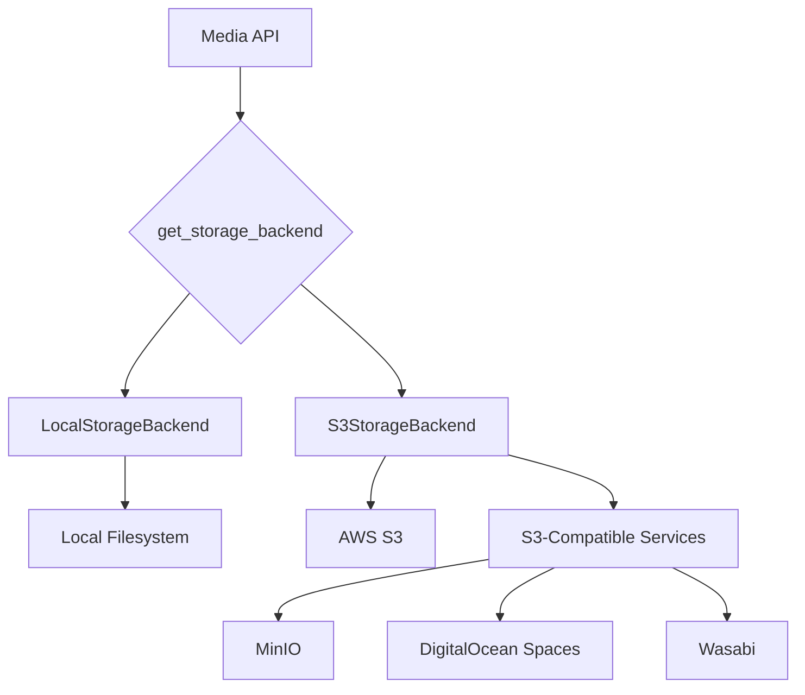
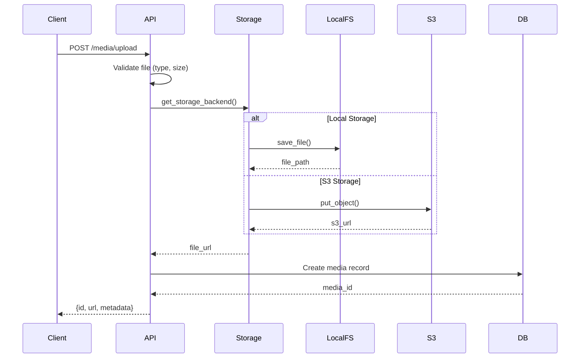
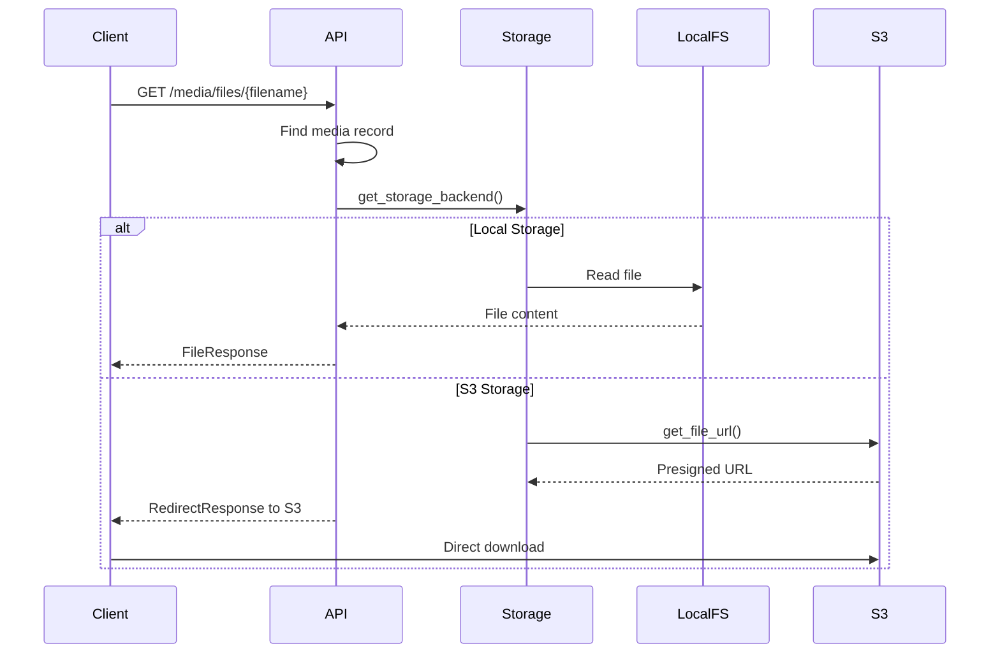

<div align="center">

# 🎂 Bakalr CMS

## Modern Headless CMS for the API-First Era

[](https://opensource.org/licenses/MIT)
[](https://www.python.org/downloads/)
[](https://fastapi.tiangolo.com)
[](https://nextjs.org)
[](https://www.docker.com/)

A production-ready headless CMS with FastAPI backend and Next.js frontend, featuring multi-tenancy, RBAC, auto-translation, full-text search, and comprehensive performance monitoring.

[Features](#-features) • [Quick Start](#-quick-start) • [Documentation](#-documentation) • [API Reference](#-api-reference) • [Contributing](#-contributing)

</div>

---

## ✨ Features

### 🏢 Multi-Tenancy & Organizations

- Complete workspace isolation with organization-level data separation
- Users can belong to multiple organizations with different roles
- Seamless tenant switching without re-authentication
- Per-organization settings and configurations

### 🔐 Security & Authentication

- **JWT Authentication**: Access and refresh tokens with configurable expiration
- **Two-Factor Auth (2FA)**: TOTP-based with backup codes
- **API Keys**: Programmatic access with permission scoping and expiration
- **RBAC**: Role-based access control with field-level permissions
- **Permission Hierarchies**: Inherited permissions with customizable rules
- **Password Security**: Bcrypt hashing with strength validation
- **CSRF Protection**: Double-submit cookie pattern
- **Rate Limiting**: 100 req/min (authenticated), 20 req/min (anonymous)
- **Security Headers**: CSP, HSTS, X-Frame-Options, X-Content-Type-Options

### 📝 Content Management

- **Dynamic Content Types**: JSON schema-based with full validation
- **Content Versioning**: Track changes with version history
- **Content Relationships**: Bidirectional linking (one-to-many, many-to-many)
- **Content Templates**: Reusable blueprints with defaults
- **Scheduled Publishing**: Publish/unpublish at specific times
- **Status Management**: Draft, published, archived workflows
- **Bulk Operations**: Efficient multi-item updates

### 🌍 Multi-Language

- **Auto-Translation**: 100+ languages via Google Translate
- **Locale Management**: Enable/disable locales per organization
- **Translation Caching**: Redis-based with 24-hour TTL
- **Fallback Support**: Automatic fallback to default locale
- **RTL Support**: Right-to-left language support

### 🔍 Search & Discovery

- **Full-Text Search**: Meilisearch with fuzzy matching and typo tolerance
- **Advanced Filtering**: Faceted search with multiple filters
- **Autocomplete**: Real-time search suggestions
- **Highlighting**: Search term highlighting in results
- **Search Analytics**: Track queries, zero-result searches, CTR

### 📊 SEO & Analytics

- **Meta Tags**: Title, description, keywords, Open Graph, Twitter Cards
- **Sitemaps**: Automatic XML generation with priorities
- **Structured Data**: Schema.org JSON-LD markup
- **Content Analytics**: View counts, popularity, update frequency
- **User Activity**: Track actions and login history
- **System Metrics**: CPU, memory, disk, performance monitoring

### 📁 Media Management

- **Multi-File Upload**: Drag-and-drop support
- **Storage Backends**: S3-compatible and local filesystem
- **Image Processing**: Automatic thumbnail generation
- **CDN Support**: CDN-ready URLs with cache headers
- **Media Library**: Browse, search, and filter

### 🔗 Integrations

- **Webhooks**: 6 event types with HMAC-SHA256 signatures
- **GraphQL API**: Flexible queries alongside REST
- **REST API**: 159+ endpoints with OpenAPI docs
- **API Versioning**: URL-based with deprecation headers

### ⚡ Performance

- **Redis Caching**: Response caching with ETag support
- **Connection Pooling**: Environment-based pool sizing
- **Query Optimization**: N+1 prevention, eager loading
- **Performance Monitoring**: Request timing, p95/p99 metrics
- **Metrics API**: 7 admin endpoints for performance data
- **Image Optimization**: WebP/AVIF with Next.js Image
- **Code Splitting**: Lazy loading and bundle optimization

## 🛠️ Tech Stack

### Backend

- **Framework**: FastAPI 0.115+ (async Python web framework)
- **Language**: Python 3.11+
- **ORM**: SQLAlchemy 2.0 with async support
- **Database**: PostgreSQL 14+ (production) or SQLite (development)
- **Caching**: Redis 7+ for caching and sessions
- **Search**: Meilisearch v1.5+ (optional)
- **Migrations**: Alembic 1.13+
- **Validation**: Pydantic 2.9+
- **Authentication**: Python-JOSE for JWT
- **Password**: Passlib with bcrypt
- **Storage**: Boto3 for S3, local filesystem
- **Monitoring**: psutil for system metrics

### Frontend

- **Framework**: Next.js 16.0.4 with App Router
- **Language**: TypeScript 5.6+
- **UI Library**: React 19
- **Styling**: TailwindCSS 3 + shadcn/ui
- **HTTP Client**: Axios with interceptors
- **Forms**: React Hook Form + Zod validation
- **Performance**: Web Vitals tracking

### Infrastructure

- **Containerization**: Docker with multi-stage builds
- **Orchestration**: Docker Compose for local/production
- **CI/CD**: GitHub Actions (test, build, security scan)
- **Proxy**: Nginx for production reverse proxy

## 🚀 Quick Start

### Option 1: Docker (Recommended)

The fastest way to get started:

```bash
# Clone the repository
git clone https://github.com/yourusername/bakalr-cms.git
cd bakalr-cms

# Configure environment
cp .env.example .env
# Edit .env with your settings

# Start all services
docker-compose up -d

# Run migrations
docker-compose exec backend alembic upgrade head

# Access the application
# Backend API: http://localhost:8000
# Frontend: http://localhost:3000
# API Docs: http://localhost:8000/api/docs
```

### Option 2: Local Development

#### Prerequisites

- Python 3.11+
- Node.js 18+ (LTS)
- PostgreSQL 14+ (or SQLite for dev)
- Redis 7+
- Poetry 1.8+

#### Backend Setup

```bash
# Install dependencies
poetry install

# Configure environment
cp .env.example .env
# Edit DATABASE_URL, REDIS_URL, SECRET_KEY

# Run migrations
poetry run alembic upgrade head

# Start backend
poetry run uvicorn backend.main:app --reload
```

Backend available at `http://localhost:8000`

#### Frontend Setup

```bash
cd frontend

# Install dependencies
npm install

# Configure environment
cp .env.local.example .env.local
# Set NEXT_PUBLIC_API_URL=http://localhost:8000

# Start frontend
npm run dev
```

Frontend available at `http://localhost:3000`

### First Steps

1. Register an account at `http://localhost:3000/register`
2. Create your organization during registration
3. Log in and explore the admin dashboard
4. Create your first content type and content entry

See the [Getting Started Guide](docs/getting-started.md) for detailed instructions.

## 📚 Documentation

### User Guides

- **[Getting Started](docs/getting-started.md)** - Installation, first steps, core concepts
- **[Quickstart Guide](docs/quickstart.md)** - 5-minute setup guide
- **[Authentication Guide](docs/authentication.md)** - JWT, 2FA, API keys, password reset

### Developer Documentation

- **[Developer Guide](docs/developer-guide.md)** - Architecture, project structure, development setup
- **[API Reference](http://localhost:8000/api/docs)** - Interactive OpenAPI documentation
- **[Database Schema](docs/database-schema.md)** - Complete schema documentation
- **[Contributing Guide](CONTRIBUTING.md)** - How to contribute to the project

### Admin Documentation

- **[Deployment Guide](docs/deployment.md)** - Docker, production setup, environment config
- **[Security Guide](docs/security.md)** - Best practices, hardening, compliance
- **[Performance Guide](docs/performance.md)** - Optimization, monitoring, load testing

### Additional Resources

- **[CHANGELOG](CHANGELOG.md)** - Version history and release notes
- **[LICENSE](LICENSE)** - MIT License
- **[NOTICE](NOTICE)** - Third-party notices

## 🎯 API Reference

### REST API

159+ endpoints across 24 modules:

- **Authentication** (7 endpoints): Login, register, refresh, logout, verify
- **Users** (6 endpoints): CRUD operations, profile management
- **Organizations** (6 endpoints): Multi-tenancy management
- **Roles** (8 endpoints): RBAC with custom roles
- **Content** (11 endpoints): Content types and entries
- **Translation** (11 endpoints): Auto-translation and locales
- **SEO** (10 endpoints): Meta tags, sitemaps, structured data
- **Media** (11 endpoints): Upload, manage files
- **Search** (8 endpoints): Full-text search with Meilisearch
- **Webhooks** (10 endpoints): Event subscriptions
- **Analytics** (11 endpoints): Content and user analytics
- **Notifications** (13 endpoints): In-app notifications
- **Metrics** (7 endpoints): Performance monitoring
- And more...

**Interactive Documentation**:
- Swagger UI: `http://localhost:8000/api/docs`
- ReDoc: `http://localhost:8000/api/redoc`
- Scalar: `http://localhost:8000/api/scalar`

### GraphQL API

8 queries and 2 mutations available at `/api/v1/graphql`:

```graphql
query {
  me {
    id
    email
    fullName
    organization {
      name
    }
  }
  contentEntries(limit: 10) {
    id
    title
    status
  }
}
```

**GraphiQL Playground** (development): `http://localhost:8000/api/v1/graphql`

## Project Structure

```text
bakalr-cms/
├── backend/
│   ├── api/               # API endpoints
│   │   ├── auth.py        # Authentication
│   │   ├── content.py     # Content management
│   │   ├── translation.py # Translation & locales
│   │   ├── seo.py         # SEO metadata & sitemaps
│   │   └── media.py       # Media file management
│   ├── core/              # Core configuration
│   │   ├── config.py
│   │   ├── security.py
│   │   ├── storage.py
│   │   ├── seo_utils.py
│   │   ├── media_utils.py
│   │   └── translation_service.py
│   ├── models/            # Database models
│   │   ├── user.py
│   │   ├── content.py
│   │   ├── translation.py
│   │   └── media.py
│   ├── db/                # Database config
│   └── main.py            # FastAPI app
├── frontend/              # Next.js app (Phase 10)
├── tests/                 # Test files
│   ├── test_auth.py
│   ├── test_content.py
│   ├── test_translation.py
│   └── test_seo.py
├── alembic/               # Database migrations
├── .env.example           # Environment template
├── pyproject.toml         # Python dependencies
├── IMPLEMENTATION_PLAN.md # Development roadmap
├── STORAGE_CONFIG.md      # Storage configuration guide
└── README.md
```

## Development

### Run Tests

```bash
# Run all tests
poetry run pytest

# Run specific test file
poetry run python test_auth.py
poetry run python test_content.py
poetry run python test_translation.py
poetry run python test_seo.py
```

## Storage & Media Management

### Storage Architecture

The media management system supports pluggable storage backends with automatic switching via configuration:



### Storage Backend Selection

Configure via the `STORAGE_BACKEND` environment variable:

**Local Storage (Default):**

```bash
STORAGE_BACKEND=local
UPLOAD_DIR=uploads
```

**AWS S3:**

```bash
STORAGE_BACKEND=s3
AWS_ACCESS_KEY_ID=your_access_key_id
AWS_SECRET_ACCESS_KEY=your_secret_access_key
AWS_REGION=us-east-1
S3_BUCKET_NAME=your-bucket-name
S3_USE_SSL=true
```

**S3-Compatible Services:**

```bash
STORAGE_BACKEND=s3
AWS_ACCESS_KEY_ID=your_key
AWS_SECRET_ACCESS_KEY=your_secret
AWS_REGION=us-east-1
S3_BUCKET_NAME=your-bucket
S3_ENDPOINT_URL=https://your-s3-service.com
S3_USE_SSL=true
```

**CDN Integration:**

```bash
STORAGE_BACKEND=s3
S3_PUBLIC_URL=https://cdn.yourdomain.com
# ... other S3 settings
```

### File Upload Flow



### File Download Flow



### Storage Features Comparison

| Feature | Local Storage | S3 Storage |
|---------|---------------|------------|
| File Upload | ✅ Direct | ✅ Via boto3 |
| File Download | ✅ Direct serve | ✅ Redirect to S3 |
| File Deletion | ✅ | ✅ |
| Thumbnail Generation | ✅ | ✅ (temp download) |
| Image Dimensions | ✅ | ⚠️ Skipped |
| CDN Support | ❌ | ✅ |
| Scalability | Limited | High |
| Cost | None | Usage-based |
| Backup | Manual | S3 versioning |

### IAM Permissions for AWS S3

```json
{
    "Version": "2012-10-17",
    "Statement": [
        {
            "Effect": "Allow",
            "Action": [
                "s3:PutObject",
                "s3:GetObject",
                "s3:DeleteObject",
                "s3:ListBucket",
                "s3:HeadObject"
            ],
            "Resource": [
                "arn:aws:s3:::your-bucket-name",
                "arn:aws:s3:::your-bucket-name/*"
            ]
        }
    ]
}
```

### S3 Bucket Configuration

**CORS (for browser access):**

```json
[
    {
        "AllowedHeaders": ["*"],
        "AllowedMethods": ["GET", "PUT", "POST", "DELETE"],
        "AllowedOrigins": ["*"],
        "ExposeHeaders": ["ETag"]
    }
]
```

**Public Read Policy:**

```json
{
    "Version": "2012-10-17",
    "Statement": [
        {
            "Sid": "PublicReadGetObject",
            "Effect": "Allow",
            "Principal": "*",
            "Action": "s3:GetObject",
            "Resource": "arn:aws:s3:::your-bucket-name/*"
        }
    ]
}
```

### Storage Backend Implementation

The system uses a pluggable architecture defined in `backend/core/storage.py`:

**StorageBackend Interface:**

```python
class StorageBackend(ABC):
    @abstractmethod
    def save_file(self, file_content: bytes, file_path: str) -> str:
        """Save file and return URL"""
        pass
    
    @abstractmethod
    def delete_file(self, file_path: str) -> bool:
        """Delete file from storage"""
        pass
    
    @abstractmethod
    def get_file_url(self, file_path: str) -> str:
        """Get public URL for file"""
        pass
    
    @abstractmethod
    def file_exists(self, file_path: str) -> bool:
        """Check if file exists"""
        pass
```

**Usage in Code:**

```python
from backend.core.storage import get_storage_backend

# Get configured storage backend
storage = get_storage_backend()

# Save file (works with local or S3)
file_url = storage.save_file(file_content, "path/to/file.jpg")

# Delete file
storage.delete_file("path/to/file.jpg")

# Check existence
if storage.file_exists("path/to/file.jpg"):
    print("File exists")
```

### Kubernetes Deployment

All storage configuration is externalized via environment variables, making it Kubernetes-ready:

```yaml
# ConfigMap example
env:
  - name: STORAGE_BACKEND
    value: "s3"
  - name: S3_BUCKET_NAME
    value: "bakalr-cms-media"
  - name: AWS_REGION
    value: "us-east-1"

# Secret example
env:
  - name: AWS_ACCESS_KEY_ID
    valueFrom:
      secretKeyRef:
        name: aws-credentials
        key: access-key-id
  - name: AWS_SECRET_ACCESS_KEY
    valueFrom:
      secretKeyRef:
        name: aws-credentials
        key: secret-access-key
```

### Testing Storage

Run storage backend tests:

```bash
# Test storage configuration
poetry run python test_storage.py

# Upload test file
curl -X POST "http://localhost:8000/api/v1/media/upload" \
  -H "Authorization: Bearer YOUR_TOKEN" \
  -F "file=@test-image.jpg"

# Verify in S3 (if using S3)
aws s3 ls s3://your-bucket-name/
```

### Migration Between Storage Backends

To migrate from local to S3:

1. **Backup** existing files
2. **Update** environment variables to S3
3. **Upload** files to S3 bucket
4. **Update** database records with new URLs
5. **Restart** application

### Troubleshooting

**S3 Connection Issues:**

```bash
# Test AWS credentials
aws s3 ls s3://your-bucket-name

# Check connectivity
aws s3api head-bucket --bucket your-bucket-name
```

**Permission Issues:**

- Verify IAM credentials have required permissions
- Check bucket policy allows operations
- Ensure bucket exists in specified region

**File Not Found:**

- Local: Check `UPLOAD_DIR` path and permissions
- S3: Verify bucket name, region, and file paths in database

### Code Formatting

```bash
poetry run black backend/
poetry run ruff check backend/
```

### Type Checking

```bash
poetry run mypy backend/
```

## Performance & Optimization

### Caching Strategy

The CMS implements a comprehensive caching strategy using Redis:

#### Response Caching

- **ETag Support**: Generates MD5 hash of response content for efficient cache validation
- **304 Not Modified**: Reduces bandwidth with If-None-Match header support
- **Cache Headers**: Automatic X-Cache headers (HIT, MISS, HIT-304) for debugging
- **Configurable TTL**: Default 300s response cache, customizable per endpoint
- **Selective Caching**: Only caches GET requests by default, with path exclusions

#### Cache Invalidation

Cache invalidation patterns ensure data consistency:

```python
# Content updates invalidate related caches
await invalidate_cache_pattern(f"content:entry:{tenant_id}:{entry_id}:*")
await invalidate_cache_pattern(f"content:list:{tenant_id}:*")
await invalidate_cache_pattern(f"seo:*:{tenant_id}:*")
```

**Invalidation Triggers**:

- Content update/delete → Content, translation, and SEO caches
- Content publish → Content list and sitemap caches
- Translation update → Translation and content caches
- Media upload/delete → Media file and stats caches

#### CDN Cache Headers

Media files served with optimized cache headers:

- **Immutable files**: `Cache-Control: public, max-age=31536000` (1 year)
- **S3 redirects**: `Cache-Control: public, max-age=3600` (1 hour)
- Compatible with CloudFront, CloudFlare, Fastly, etc.

#### Cache Configuration

```bash
# Environment variables
REDIS_URL=redis://localhost:6379/0
REDIS_MAX_CONNECTIONS=10
CACHE_DEFAULT_TTL=300  # 5 minutes
```

### Rate Limiting

Multi-tier rate limiting with Redis backend:

#### Rate Limit Tiers

| Tier | Limits | Use Case |
|------|--------|----------|
| Anonymous | 100/hour, 10/minute | Unauthenticated requests |
| Authenticated | 1000/hour, 100/minute | Regular users |
| API Key Free | 5000/hour, 100/minute | Free tier API access |
| API Key Pro | 50000/hour, 500/minute | Pro tier API access |
| Enterprise | Unlimited | Enterprise customers |
| Expensive Ops | 50/hour | Uploads, translations, searches |

#### Rate Limit Headers

All responses include rate limit information:

```http
X-RateLimit-Limit: 1000
X-RateLimit-Remaining: 847
X-RateLimit-Reset: 1700000000
```

#### Per-Endpoint Limits

Custom rate limits for specific operations:

```python
@router.post("/upload")
@rate_limit("50/hour")  # Upload-specific limit
async def upload_media():
    pass
```

#### Identifier Resolution

Rate limits identified by (in priority order):

1. API Key (from X-API-Key header)
2. User ID (from JWT token)
3. IP Address (fallback)

#### Rate Limit Configuration

```bash
# Environment variables
REDIS_URL=redis://localhost:6379/0
RATE_LIMIT_ENABLED=true
RATE_LIMIT_STORAGE_URL=redis://localhost:6379/1
```

### Cache Patterns

Centralized cache key patterns for all resources:

```python
# Content
content:entry:{tenant_id}:{entry_id}:{version}
content:list:{tenant_id}:{content_type}:{filters}
content:type:{tenant_id}:{type_id}

# Translations
translation:{tenant_id}:{entry_id}:{locale}
translation:list:{tenant_id}:{locale}

# Media
media:file:{tenant_id}:{media_id}
media:stats:{tenant_id}

# SEO
seo:meta:{tenant_id}:{entry_id}
seo:sitemap:{tenant_id}:{locale}

# User
user:profile:{user_id}
user:permissions:{user_id}:{tenant_id}
```

## Webhooks & Events

The CMS includes a comprehensive webhook system for event-driven integrations.

### Webhook Features

- **Event Types**: Content, media, translation, user, and organization events
- **HMAC Signatures**: Secure payload verification with HMAC-SHA256
- **Automatic Retries**: Exponential backoff (60s, 120s, 240s, ...)
- **Delivery Tracking**: Full logging of attempts, responses, and errors
- **Custom Headers**: Support for authentication headers
- **Testing**: Built-in webhook testing with custom payloads

### Available Events

```text
content.created       - Content entry created
content.updated       - Content entry updated
content.deleted       - Content entry deleted
content.published     - Content entry published
content.unpublished   - Content entry unpublished

media.uploaded        - Media file uploaded
media.updated         - Media file metadata updated
media.deleted         - Media file deleted

translation.created   - Translation created
translation.updated   - Translation updated

user.created          - User account created
user.updated          - User account updated
user.deleted          - User account deleted

organization.created  - Organization created
organization.updated  - Organization updated
```

### Creating a Webhook

```bash
POST /api/webhooks
Content-Type: application/json
Authorization: Bearer {token}

{
  "name": "My Webhook",
  "description": "Notify on content changes",
  "url": "https://example.com/webhooks/cms",
  "events": ["content.created", "content.updated", "content.published"],
  "headers": {
    "Authorization": "Bearer my-secret-token"
  },
  "max_retries": 3,
  "retry_delay": 60
}

Response:
{
  "id": 1,
  "secret": "abc123xyz789...",
  "message": "Store this secret securely. It will not be shown again."
}
```

### Verifying Webhook Signatures

All webhook requests include an `X-Webhook-Signature` header with HMAC-SHA256 signature:

```python
import hmac
import hashlib

def verify_webhook(payload: bytes, signature: str, secret: str) -> bool:
    """Verify webhook signature"""
    expected = hmac.new(
        secret.encode(),
        payload,
        hashlib.sha256
    ).hexdigest()
    return hmac.compare_digest(f"sha256={expected}", signature)

# Usage
payload = request.body  # Raw request body
signature = request.headers["X-Webhook-Signature"]
secret = "your-webhook-secret"

if verify_webhook(payload, signature, secret):
    # Process webhook
    pass
```

### Webhook Payload Structure

```json
{
  "event_id": "evt_1234567890abcdef",
  "event_type": "content.created",
  "timestamp": "2025-11-24T12:00:00Z",
  "organization_id": 1,
  "data": {
    "content_id": 42,
    "type": "blog_post",
    "title": "New Blog Post",
    "status": "draft",
    "author_id": 1
  }
}
```

### Webhook Headers

Each webhook request includes:

- `X-Webhook-Signature`: HMAC-SHA256 signature
- `X-Webhook-ID`: Webhook ID
- `X-Event-Type`: Event type
- `X-Event-ID`: Unique event identifier
- `X-Delivery-ID`: Delivery attempt ID
- `X-Delivery-Attempt`: Attempt number (1, 2, 3, ...)
- `Content-Type`: application/json
- `User-Agent`: Bakalr-CMS-Webhook/1.0

### Testing Webhooks

```bash
POST /api/webhooks/{webhook_id}/test
Content-Type: application/json
Authorization: Bearer {token}

{
  "event_type": "content.created",
  "custom_payload": {
    "test": true,
    "message": "This is a test"
  }
}
```

### Managing Deliveries

```bash
# List delivery attempts
GET /api/webhooks/{webhook_id}/deliveries

# Get delivery details
GET /api/webhooks/{webhook_id}/deliveries/{delivery_id}

# Retry failed delivery
POST /api/webhooks/{webhook_id}/deliveries/{delivery_id}/retry
```

### Retry Behavior

- **Initial attempt**: Immediate delivery
- **Retry 1**: After 60 seconds
- **Retry 2**: After 120 seconds (2 minutes)
- **Retry 3**: After 240 seconds (4 minutes)
- **Max retries**: Configurable (default 3)

Deliveries are retried only for:

- Network errors (timeout, connection refused)
- HTTP 5xx server errors
- HTTP 429 (rate limited)

Successful responses (2xx) and client errors (4xx, except 429) do not trigger retries.

## Multi-Organization & Tenant Switching

Users can belong to multiple organizations and seamlessly switch between them with different roles in each organization.

### Use Cases

- **Agencies**: Manage multiple client organizations
- **Contractors**: Work for multiple companies with different permissions
- **Consultants**: Access multiple project workspaces
- **Multi-brand companies**: Manage separate brand workspaces

### Tenant Switching Features

- Users can be members of multiple organizations
- Different roles per organization (e.g., Admin in Org A, Editor in Org B)
- Seamless switching with JWT token refresh
- Set default organization for automatic login
- Invite users to your organization
- Remove users from organization (requires permissions)

### API Endpoints

#### List User's Organizations

```bash
GET /api/v1/tenant/organizations
Authorization: Bearer {token}

Response:
{
  "current_organization_id": 1,
  "organizations": [
    {
      "organization_id": 1,
      "organization_name": "Agency A",
      "organization_slug": "agency-a",
      "is_default": true,
      "is_active": true,
      "roles": ["admin", "editor"],
      "joined_at": "2025-01-01T00:00:00Z"
    },
    {
      "organization_id": 2,
      "organization_name": "Client B",
      "organization_slug": "client-b",
      "is_default": false,
      "is_active": true,
      "roles": ["viewer"],
      "joined_at": "2025-02-15T10:30:00Z"
    }
  ],
  "total": 2
}
```

#### Switch to Different Organization

```bash
POST /api/v1/tenant/switch
Authorization: Bearer {token}
Content-Type: application/json

{
  "organization_id": 2
}

Response:
{
  "access_token": "new_jwt_token...",
  "refresh_token": "new_refresh_token...",
  "token_type": "bearer",
  "organization_id": 2,
  "organization_name": "Client B",
  "roles": ["viewer"],
  "message": "Successfully switched to Client B"
}
```

After switching, use the new tokens for all subsequent requests. All data will be scoped to the new organization.

#### Set Default Organization

```bash
POST /api/v1/tenant/set-default
Authorization: Bearer {token}
Content-Type: application/json

{
  "organization_id": 2
}

Response:
{
  "organization_id": 2,
  "organization_name": "Client B",
  "is_default": true,
  "message": "Client B is now your default organization"
}
```

#### Invite User to Organization

```bash
POST /api/v1/tenant/invite
Authorization: Bearer {token}
Content-Type: application/json

{
  "email": "user@example.com",
  "role_names": ["editor", "contributor"]
}

Response:
{
  "user_id": 42,
  "email": "user@example.com",
  "organization_id": 1,
  "organization_name": "Agency A",
  "invitation_sent": true,
  "message": "user@example.com has been added to Agency A"
}
```

**Requirements**: 'users.manage' permission in current organization

#### Remove User from Organization

```bash
DELETE /api/v1/tenant/remove/{user_id}
Authorization: Bearer {token}

Response:
{
  "message": "User user@example.com has been removed from the organization",
  "user_id": 42,
  "organization_id": 1
}
```

**Requirements**:

- 'users.manage' permission
- Cannot remove yourself
- Cannot remove the last admin

### Multi-Organization Workflow Example

1. **Designer logs in** → Starts in default organization (Agency A)
2. **Check organizations** → `GET /tenant/organizations` (sees 3 organizations)
3. **Switch to Client B** → `POST /tenant/switch` with org_id=2
4. **Receive new tokens** → Use new JWT for all requests
5. **Work on Client B** → All API calls scoped to Client B
6. **Switch back to Agency A** → `POST /tenant/switch` with org_id=1
7. **Set default org** → `POST /tenant/set-default` for auto-selection on next login

### Security & Isolation

- Organization membership verified before switching
- Inactive organizations cannot be switched to
- JWT contains `org_id` for automatic tenant filtering
- All database queries automatically filtered by organization_id
- Cross-tenant data access prevented by middleware
- Role assignments scoped to organization
- Invitation system prevents unauthorized access

## Testing

All major features have comprehensive test coverage. Tests are written using pytest with async support.

### Running Tests

```bash
# Run all tests
poetry run pytest

# Run tests with coverage
poetry run pytest --cov=backend --cov-report=html

# Run specific test suite
poetry run pytest test_auth.py -v
poetry run pytest test_content.py -v
poetry run pytest test_translation.py -v
poetry run pytest test_seo.py -v
poetry run pytest test_storage.py -v
poetry run pytest test_cache.py -v        # Requires Redis
poetry run pytest test_rate_limit.py -v   # Requires Redis
```

### Redis Requirement

Cache and rate limit tests require a running Redis instance:

```bash
# macOS with Homebrew
brew services start redis

# Linux
sudo systemctl start redis

# Docker
docker run -d -p 6379:6379 redis:latest
```

## Current Status

✅ **Phases 1-13 Complete + Phase 6.5** (including Phase 11 Frontend, Phase 12 Notifications, Phase 6.5 Advanced Search)

### Backend Features

- **Database**: 27 tables with full multi-tenancy support
- **Backend API**: 152+ REST endpoints across 19 modules
- **GraphQL API**: Flexible query interface at /api/v1/graphql with 8 queries, 2 mutations
- **Authentication**: JWT with refresh tokens, 2FA (TOTP), API keys, tenant switching
- **Authorization**: Comprehensive RBAC with field-level permissions, role hierarchies
- **Content Management**: Full CRUD with versioning, relationships, templates, scheduling
- **Translation**: Auto-translation to 100+ locales with Google Translate/DeepL
- **SEO**: Metadata, sitemaps, structured data, Open Graph, Twitter Cards
- **Media**: Upload, thumbnails, local/S3 storage, CDN optimization
- **Search**: Meilisearch with full-text search, fuzzy matching, typo tolerance, highlighting, autocomplete, faceted filtering
- **Caching**: Redis with ETags, response caching, cache warming
- **Rate Limiting**: SlowAPI with per-user/tenant/IP limits
- **Webhooks**: Event-driven with HMAC signatures, retries, delivery tracking
- **Notifications**: In-app notifications with email delivery (13 endpoints)
- **Email System**: FastAPI-Mail with 4 templates, delivery tracking, retry logic
- **Theming**: Custom themes with Dark Chocolate default, CSS variables export
- **Testing**: 51+ tests across 6 comprehensive test suites

### Frontend Application

- **Framework**: Next.js 16.0.4 with App Router and TypeScript
- **Styling**: TailwindCSS with dark chocolate brown theme (#3D2817)
- **UI Components**: shadcn/ui (12 components: button, card, input, label, select, textarea, dropdown-menu, sheet, dialog, avatar, badge, separator)
- **Authentication**: JWT-based with automatic token refresh, protected routes
- **API Clients**: Axios for REST (with interceptors), Fetch for GraphQL
- **State Management**: React Context (AuthProvider for user state)
- **Pages**: Landing page, login, register, admin dashboard with sidebar navigation
- **Features**: Responsive layout, dark/light mode, user profile dropdown, organization context

## GraphQL API (Alternative Query Interface)

The CMS provides a GraphQL interface alongside the REST API for flexible querying.

### GraphQL Endpoint

- **URL**: `http://localhost:8000/api/v1/graphql`
- **Playground**: Available in debug mode at same URL
- **Authentication**: JWT token via `Authorization: Bearer <token>` header
- **Organization Scoping**: All queries automatically filtered by user's organization

### Example Queries

**Get content entries with nested data:**

```graphql
query GetBlogPosts {
  contentEntries(
    page: 1,
    per_page: 10,
    status: "published",
    content_type_slug: "blog_post"
  ) {
    items {
      id
      slug
      status
      content_data
      published_at
      author {
        email
        full_name
      }
      content_type {
        name
        slug
        fields
      }
    }
    pagination {
      total
      page
      total_pages
      has_next
      has_prev
    }
  }
}
```

**Get current user profile:**

```graphql
query Me {
  me {
    id
    email
    full_name
    organization {
      name
      slug
    }
  }
}
```

**List media files:**

```graphql
query GetMedia {
  media(page: 1, per_page: 20) {
    items {
      id
      filename
      content_type
      public_url
      alt_text
      width
      height
      uploaded_by {
        email
      }
    }
    pagination {
      total
      has_next
    }
  }
}
```

### Example Mutations

**Publish content entry:**

```graphql
mutation PublishPost {
  publishContent(id: 42) {
    id
    slug
    status
    published_at
  }
}
```

**Unpublish content entry:**

```graphql
mutation UnpublishPost {
  unpublishContent(id: 42) {
    id
    status
  }
}
```

### Available Queries

- `contentEntry(id: Int!)` - Get single content entry
- `contentEntries(page, per_page, status, content_type_slug)` - List content with filters
- `contentTypes()` - List all content types
- `media(page, per_page)` - List media files
- `me()` - Current authenticated user
- `locales()` - Enabled locales
- `themes()` - Organization themes
- `contentTemplates(published_only)` - List content templates

### Available Mutations

- `publishContent(id: Int!)` - Publish content (requires `content.publish` permission)
- `unpublishContent(id: Int!)` - Unpublish content (requires `content.update` permission)

### Benefits vs REST API

- **Flexible Data Fetching**: Request only the fields you need
- **Nested Relationships**: Get related data in a single query
- **Reduced Over-fetching**: Avoid unnecessary data transfer
- **Strong Typing**: Type-safe queries with validation
- **Self-Documenting**: Introspection for schema exploration
- **Developer Experience**: GraphiQL playground for testing

## Implementation Details

### Content Templates & Blueprints

Content templates provide reusable structures for rapid content creation with predefined field defaults and configurations.

#### Template Key Features

- **Field Defaults**: Pre-fill common values (status=draft, author=current_user)
- **Field Configuration**: Validation rules, help text, editor preferences per field
- **Content Structure**: Define sections, layouts, required vs optional fields
- **Template Categories**: Group templates (blog, product, landing-page)
- **Tag-based Discovery**: Search templates by tags
- **Usage Tracking**: Monitor template popularity and applications
- **Smart Merging**: User overrides take precedence over template defaults

#### Template Use Cases

- Blog post templates (Standard Article, Tutorial, News, Interview)
- Product page templates (Physical Product, Digital Product, Service)
- Landing page templates (Sales, Lead Generation, Event Registration)
- Marketing templates (Email Campaign, Social Media Post)
- Documentation templates (API Reference, How-to Guide, FAQ)

#### Template Configuration

```bash
CONTENT_TEMPLATES_ENABLED=true
MAX_TEMPLATES_PER_TYPE=50
```

### Two-Factor Authentication (2FA)

TOTP-based two-factor authentication with backup codes for enhanced account security.

#### 2FA Features

- **TOTP Standard**: RFC 6238 compliant, 30-second validity window
- **Authenticator Apps**: Compatible with Google Authenticator, Microsoft Authenticator, Authy
- **QR Code Provisioning**: Easy setup by scanning QR code
- **Backup Codes**: 10 one-time recovery codes (bcrypt-hashed)
- **Role-based Enforcement**: Optional mandatory 2FA for admin roles
- **Clock Drift Tolerance**: ±1 window for time synchronization issues

#### 2FA Configuration

```bash
TWO_FACTOR_ENABLED=true
TWO_FACTOR_ISSUER_NAME="Bakalr CMS"
TWO_FACTOR_CODE_VALIDITY_SECONDS=30
TWO_FACTOR_BACKUP_CODES_COUNT=10
TWO_FACTOR_ENFORCE_FOR_ADMINS=false
```

#### 2FA User Workflow

1. Call `/auth/2fa/enable` → Receive QR code, secret, and 10 backup codes
2. Scan QR code with authenticator app
3. Call `/auth/2fa/verify-setup` with code from app → 2FA activated
4. Login now requires TOTP code verification
5. Lost device → Use backup codes via `/auth/2fa/verify-backup`
6. Call `/auth/2fa/backup-codes/regenerate` → New codes issued (old invalidated)

### Tenant Switching for Multi-Organization Users

Users can belong to multiple organizations and seamlessly switch between them with different roles in each.

#### Tenant Database Schema

**UserOrganization** many-to-many association table:

- `user_id`, `organization_id` - Relationships with CASCADE delete
- `is_active` - Active membership status
- `is_default` - Default organization for login
- `role_context` - JSON field for per-organization role assignments
- `invited_by` - Invitation tracking
- `invitation_accepted_at` - Invitation acceptance timestamp
- Unique constraint on (user_id, organization_id)
- Indexes on foreign keys for performance

#### Multi-Tenant Capabilities

- **Multiple Organizations**: Users belong to multiple orgs simultaneously
- **Seamless Switching**: JWT token refresh on organization switch
- **Per-Organization Roles**: Different permissions in each organization
- **Default Organization**: Automatic organization on login
- **Invitation System**: Invite users with role assignments
- **Organization Management**: Add/remove users (requires `users.manage` permission)
- **Backward Compatible**: Single-org users still supported

#### Tenant Security & Isolation

- Organization membership verified before switching
- Inactive organizations cannot be switched to
- JWT contains `org_id` for automatic tenant filtering
- Cross-tenant data access prevented by middleware
- Role assignments scoped to organization
- Prevents self-removal and unauthorized access

#### Tenant Switching Use Cases

**Agency Managing Multiple Clients**:
Designer works for Agency A (Admin), Client B (Editor), Client C (Viewer)

- Switches between clients seamlessly
- Different permissions per client
- Manages multiple projects efficiently

**Contractor for Multiple Companies**:
Developer works for Company X (Admin), Company Y (Contributor)

- Access different codebases per company
- Different development permissions
- Single account across all companies

**Multi-Brand Company**:
Manager oversees Brand A (Admin), Brand B (Admin), Brand C (Editor)

- Switch between brand workspaces
- Consistent brand management
- Centralized account management

#### Tenant Authentication Flow

1. User logs in → JWT contains current `organization_id`
2. User calls `GET /tenant/organizations` → See all accessible orgs
3. User calls `POST /tenant/switch` with target `org_id` → New JWT issued
4. All subsequent API calls use new organization context
5. User can set default org for automatic selection on next login

## Documentation

See [IMPLEMENTATION_PLAN.md](IMPLEMENTATION_PLAN.md) for the complete implementation roadmap and progress tracking.

## Content Editor Features

The admin dashboard includes a powerful content editor with advanced features for managing dynamic content.

### Rich Text Editor (TipTap)

**Field Types**: `richtext`, `wysiwyg`, `html`

WYSIWYG editor with comprehensive formatting toolbar:

- **Text Formatting**: Bold, Italic, Headings (H1, H2)
- **Lists**: Bullet lists, Numbered lists
- **Blockquotes**: For quotations
- **Links**: Add hyperlinks
- **Images**: Insert via URL or media picker
- **History**: Undo/Redo support
- **Output**: Clean semantic HTML

**Example Schema**:

```json
{
  "body": {
    "type": "richtext",
    "label": "Article Body",
    "description": "The main content of the article",
    "required": true
  }
}
```

### Media Picker

**Field Types**: `image`, `file`, `media`

Visual media browser with upload capability:

- Browse existing media files in grid view
- Upload new files via drag-and-drop or button
- Search by filename
- Filter by type (images, videos, audio, documents)
- Pagination for large libraries
- Image thumbnails and file information
- Automatic URL population

**Usage**:

1. Click "Browse" button next to image/file field
2. Select existing file or upload new one
3. Click "Select" to use the chosen file
4. URL auto-populated with preview (for images)

**Example Schema**:

```json
{
  "featured_image": {
    "type": "image",
    "label": "Featured Image",
    "description": "Main article image"
  }
}
```

### Multi-language Translation Tabs

**Requirements**: Create locales in organization settings first

Translation interface with tab-based navigation:

- Default content tab + one tab per enabled locale
- All field types supported (including rich text and media)
- Translation forms with fallback to default content
- Auto-save translations alongside content
- Visual indicators (Globe icon)

**Workflow**:

1. Create content in "Default Content" tab
2. Switch to locale tab (e.g., "Español", "Français")
3. Fill in translated versions of fields
4. Leave fields empty to use default content
5. Save to store all translations together

### Content Type Builder

Visual schema builder for creating content types without writing JSON:

- **12 Field Types**: Text, Textarea, Rich Text, Number, Email, URL, Select, Boolean, Image, File, Date, DateTime
- **Visual Interface**: Click field type cards to add fields
- **Field Configuration**: Dynamic property editor for each field type
- **Field Reordering**: Up/down arrows to change field order
- **Schema Validation**: Duplicate key detection, required fields check
- **Edit Existing**: Load and modify existing content type schemas

**Supported Field Types**:

- `text` - Single-line text input
- `textarea` - Multi-line plain text
- `richtext`/`wysiwyg`/`html` - TipTap WYSIWYG editor
- `number` - Numeric input with min/max validation
- `email` - Email with validation
- `url` - URL with validation
- `select` - Dropdown with custom options
- `boolean` - Checkbox
- `image`/`file`/`media` - Media picker integration
- `date` - Date picker
- `datetime` - Date and time picker

**Example: Creating a Blog Post Content Type**:

1. Navigate to Content Types → Create Content Type
2. Enter name: "Blog Post" (auto-generates slug: `blog_post`)
3. Add fields:
   - Title (text, required)
   - Excerpt (textarea)
   - Body (richtext, required)
   - Featured Image (image)
   - Category (select with options)
   - Published (boolean)
4. Configure each field's properties
5. Reorder fields as needed
6. Save → Content type ready for use

## 🤝 Contributing

We welcome contributions from the community! Whether you're fixing bugs, adding features, improving documentation, or reporting issues, your help is appreciated.

### Ways to Contribute

- **Report Bugs**: Open an issue with detailed reproduction steps
- **Suggest Features**: Describe your idea and use case
- **Submit Pull Requests**: Fork, create a branch, make changes, and open a PR
- **Improve Documentation**: Fix typos, add examples, clarify explanations
- **Write Tests**: Increase code coverage and test edge cases

### Development Workflow

1. **Fork the Repository**: Click the "Fork" button on GitHub
2. **Clone Your Fork**:
   ```bash
   git clone https://github.com/YOUR_USERNAME/bakalr-cms.git
   cd bakalr-cms
   ```
3. **Create a Branch**:
   ```bash
   git checkout -b feature/your-feature-name
   ```
4. **Make Changes**: Follow the code style guidelines in the [Developer Guide](docs/developer-guide.md)
5. **Run Tests**:
   ```bash
   # Backend tests
   poetry run pytest
   
   # Frontend tests
   cd frontend && npm test
   ```
6. **Commit Changes**: Use [Conventional Commits](https://www.conventionalcommits.org/) format:
   ```bash
   git commit -m "feat: add new feature"
   git commit -m "fix: resolve bug in content API"
   git commit -m "docs: update installation guide"
   ```
7. **Push and Create PR**:
   ```bash
   git push origin feature/your-feature-name
   ```
   Then open a Pull Request on GitHub with a clear description of your changes.

### Code Style

- **Backend**: Follow PEP 8 (Python), use type hints, add docstrings
- **Frontend**: Follow Airbnb style guide (TypeScript), use ESLint/Prettier
- **Git**: Use Conventional Commits format for commit messages

For more details, see the [Developer Guide](docs/developer-guide.md).

## 📄 License

This project is licensed under the **MIT License** - see the [LICENSE](LICENSE) file for details.

### Third-Party Licenses

Bakalr CMS uses several open-source libraries and frameworks. See the [NOTICE](NOTICE) file for full attribution and license information for all dependencies.

## 🙏 Acknowledgments

- **FastAPI** for the high-performance backend framework
- **Next.js** for the modern React framework
- **PostgreSQL** for robust data storage
- **Meilisearch** for lightning-fast search
- **Redis** for efficient caching
- All the amazing open-source contributors whose libraries power this project

## 📞 Support

- **Documentation**: [Getting Started Guide](docs/getting-started.md)
- **Issues**: [GitHub Issues](https://github.com/YOUR_USERNAME/bakalr-cms/issues)
- **Discussions**: [GitHub Discussions](https://github.com/YOUR_USERNAME/bakalr-cms/discussions)

---

<div align="center">

**[⬆ Back to Top](#-bakalr-cms)**

Made with ❤️ by the Bakalr CMS Contributors

</div>
